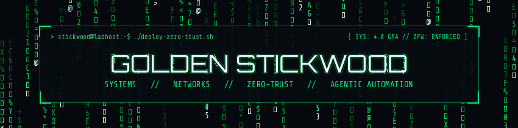

  

# Hi, I'm Golden 👋

I'm a **systems and network infrastructure builder** based in the Greater Toronto Area. Currently completing Seneca Polytechnic's Computer Systems Technology (CTYC) program (President's Honour List, 4.0 GPA), I focus on **enterprise systems administration, zero-trust network engineering, and agentic infrastructure automation**.

Outside the classroom, I designed and built a boundary-enforced virtualized homelab, I’ve worked with configuring directory and identity services across Windows and Linux, and engineered practical agentic workflows with modern LLMs and local runtimes to keep systems reproducible, automated, and secure.

---

## System Objectives & Focus

- **Zero-Trust Virtualization & Boundary Routing:** Architecting hardware-constrained guest environments with `KVM/QEMU`, `Cisco IOSv` virtual routing, Zone-Based Policy Firewalls (`ZFW`), isolated `libvirt` bridges, dynamic NAT, and zero open inbound ports via `Cloudflare Tunnels` and `Tailscale WireGuard` mesh.
- **Enterprise Directory & Identity Services:** Deploying Active Directory Domain Services (`AD DS`), multi-site Organizational Unit design, granular Group Policy Objects (`GPOs`), `DHCP/DNS` integration, and role-based access control across Windows Server (GUI & Core) and Linux.
- **Agentic Coding & Workflow Automation:** Building autonomous multi-agent pipelines and developer workflows using [Claude Code](https://www.claude.com/product/claude-code), [Google Antigravity](https://github.com/google/antigravity), and Codex for codebase operations, log analysis, and systems auditing.
- **Local AI & Live Educational RAG:** Running privacy-first local LLMs with `Ollama` and engineering zero-cache live knowledge retrieval pipelines connecting `Google NotebookLM` and `Gemini` via Model Context Protocol (`MCP`) bridges.
- **Network Engineering & Diagnostics:** Configuring Cisco IOS switching and routing (`802.1Q` VLAN trunking, single-area `OSPFv2`, NAT/PAT, port security), with packet-level inspection and traffic analysis using `Wireshark` and `Nmap`.

---

## Tech Stack & Environments

**Operating Systems:**      

**Networking & Security:**      

**AI & Agentic Tooling:**       

**Virtualization & Cloud:**    

**Scripting & Automation:**    

---

## Featured Repositories

| Repository | Focus & Architecture |
| :--- | :--- |
| [**homelab-public**](https://github.com/StickwoodJr/homelab-public) | Enterprise-grade zero-trust homelab on a repurposed host node: Debian 13, KVM/QEMU, Cisco IOSv Zone-Based Firewall, 3-tier isolated routing, and automated disaster recovery. |
| [**ai-job-search-enhanced**](https://github.com/StickwoodJr/ai-job-search-enhanced) | Autonomous multi-agent job search OS for Claude Code & Antigravity featuring Canadian portal scrapers, Indeed swarm intelligence, NotebookLM RAG verification, and LaTeX ATS generation. |
| [**usb4-nvme-direct-boot**](https://github.com/StickwoodJr/usb4-nvme-direct-boot) | Universal USB4 / Thunderbolt 4 NVMe direct-boot suite for Linux: kernel parameters, initramfs drop-ins, and UEFI boot forensics over 40 Gbps PCIe Gen 4 x4 bridges. |
| [**grade-calculator-mcp**](https://github.com/StickwoodJr/grade-calculator-mcp) | Custom Model Context Protocol (MCP) server for fast weighted academic evaluation and projection. |

---

## Connect & Reach Out

- 👔 [LinkedIn](https://www.linkedin.com/in/golden-q-stickwood-8404aa23b/)
- 📍 Greater Toronto Area, Ontario, Canada

<!---
StickwoodJr/StickwoodJr is a ✨ special ✨ repository because its `README.md` (this file) appears on your GitHub profile.
You can click the Preview link to take a look at your changes.
--->
